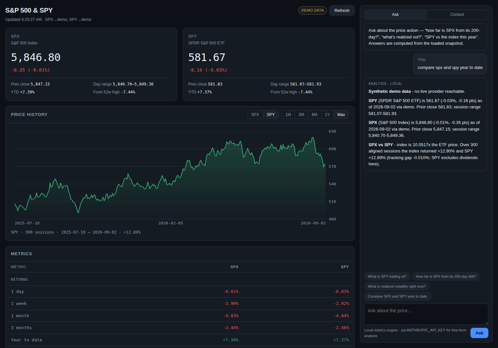

# Quant Dashboard — S&P 500 / SPY

Step one of a quantitative trading toolkit: a local dashboard that pulls the
S&P 500 index (SPX) and the SPY ETF, computes a standard metric set from the
daily history, and gives you a query panel on the right to ask about the price
action or record context the analysis should take into account.



## Requirements

**Python 3.10 or newer.** Check with `python3 --version`.

## Quick start

```bash
python3 -m venv .venv && source .venv/bin/activate
pip install -r requirements.txt
./run.sh                      # → http://127.0.0.1:8000
```

That is the whole install. The dashboard and the query panel both work with
nothing else — no API key, no account.

### Optional: Claude-powered answers

The query panel ships with a built-in engine that answers from the computed
metrics. To also allow free-form questions, install the optional dependency
and set a key:

```bash
pip install -r requirements-assistant.txt   # needs Python 3.10+
export ANTHROPIC_API_KEY=sk-ant-...
./run.sh
```

Skip this and everything still runs; the panel just stays on the local engine.

## What's on screen

**Left — market.** Live quote cards for SPX and SPY (last, change, previous
close, session range, YTD, distance from the 52-week high), an interactive
price chart with 1M/3M/6M/1Y/Max ranges and a hover readout of the OHLC for
any session, and a side-by-side metrics table.

**Right — query panel.** Two tabs:

- **Ask** — questions about the loaded snapshot: *"how far is SPX from its
  200-day?"*, *"what's realized vol?"*, *"compare SPX and SPY year to date"*.
- **Context** — notes you save (positions, theses, constraints). They persist
  to `data/context.json` and are sent with every question.

### Two answer engines

| | When it's used | What it does |
|---|---|---|
| **Local** | Always available. No key, no network. | Pattern-matches the question to an intent and answers straight from the computed metrics. Every number is reproducible from the same snapshot. |
| **Claude** | When `ANTHROPIC_API_KEY` is set and `anthropic` is installed. | Sends the metrics and your context notes to `claude-opus-5` for free-form analysis. |

The local engine is the floor: if the Claude call fails for any reason, the
answer degrades to local metrics with a warning rather than erroring out.

## Metrics computed

Returns (1d/1w/1m/3m/6m/1y/YTD) · SMA 20/50/200 and distance from each · trend
classification · annualised realized volatility (20d, 60d) · Wilder RSI(14) ·
52-week high/low and distance from each · max drawdown · SPX↔SPY price ratio
and tracking gap.

All of it lives in `app/analytics.py` as pure functions over a bar list, so
each number is unit-testable and reproducible.

## Data sources

Tried in order; the first that returns usable data wins.

1. **Yahoo Finance** (`query{1,2}.finance.yahoo.com/v8/finance/chart`) —
   intraday accurate, no API key. Hardened against Yahoo's bot defences:
   persistent session, cookie/crumb minting, browser headers, host
   alternation and exponential backoff on throttling.
2. **Stooq** (daily CSV) — end-of-day fallback, no API key.
3. **Demo** — a seeded synthetic random walk so the app runs fully offline.
   SPY is derived from the index series so the two stay coherent. The UI
   labels this **DEMO DATA** in amber and every answer says so.

Neither live source is an official market feed. Treat the data as indicative,
not as a system of record.

See **[docs/data-sources.md](docs/data-sources.md)** for the full evaluation,
including why Futu/moomoo is not wired in yet and what would justify it.

### Diagnosing the data feed

If the dashboard shows the amber **DEMO DATA** badge, both live providers
failed. To see which one and why:

```bash
python -m app.diagnose          # add -v for debug logging
```

It tries every provider against both instruments and prints the price, bar
count and latency on success, or the exact error on failure.

## Configuration

| Variable | Default | Purpose |
|---|---|---|
| `QUANT_PROVIDERS` | `yahoo,stooq,demo` | Provider chain, in priority order |
| `QUANT_LOOKBACK_DAYS` | `420` | Calendar days of history to request |
| `QUANT_CACHE_TTL` | `60` | Seconds before a symbol is refetched |
| `ANTHROPIC_API_KEY` | — | Enables the Claude engine |
| `ANTHROPIC_MODEL` | `claude-opus-5` | Model for the assistant |
| `ANTHROPIC_MAX_TOKENS` | `16000` | Response cap (thinking tokens count toward it) |
| `PORT` | `8000` | Server port |

Force offline mode with `QUANT_PROVIDERS=demo ./run.sh`.

## HTTP API

| Method | Path | Purpose |
|---|---|---|
| `GET` | `/api/health` | Status, provider chain, assistant availability |
| `GET` | `/api/market?refresh=&history=` | Quotes, metrics and bars for both instruments |
| `GET` | `/api/market/{symbol}` | One instrument (`spx` or `spy`) |
| `POST` | `/api/ask` | `{question, history?, engine?}` → answer |
| `GET`/`POST` | `/api/context` | List / add a context note |
| `DELETE` | `/api/context/{id}` | Remove a note |

## Layout

```
app/
  config.py      environment-driven settings
  models.py      Bar / Quote / Series
  providers.py   Yahoo, Stooq and demo data sources
  analytics.py   pure metric functions
  market.py      provider fallback, caching, snapshot assembly
  assistant.py   context store, local engine, Claude engine
  main.py        FastAPI routes + static hosting
  diagnose.py    `python -m app.diagnose` provider connectivity check
web/             dashboard (no build step, no external JS)
tests/           pytest suite
```

## Tests

```bash
pip install -r requirements-dev.txt
python -m pytest -q
```

Without the optional `anthropic` package installed, the two tests that exercise
the Claude client skip and the rest still run.

Coverage includes the metric maths against hand-computed values, provider
parsing from captured payload fixtures (including Yahoo's null-padded holiday
sessions and Stooq's throttle pages), provider fallback and stale-cache
behaviour, question routing, and the Claude request shape verified at the wire
level against a local mock server — no live API calls, no key needed.

## Scope and caveats

- Prices are indicative; SPY returns here exclude dividends, so the tracking
  gap against the index is expected to be slightly negative.
- The assistant describes what the data shows. It is not investment advice and
  does not issue buy/sell recommendations.
- Context notes are stored unencrypted in `data/context.json` (gitignored).

## Next steps

Natural extensions from here: intraday bars, additional instruments, a
backtesting harness over the same `Bar` series, signal generation, and
position/PnL tracking wired into the context panel.
